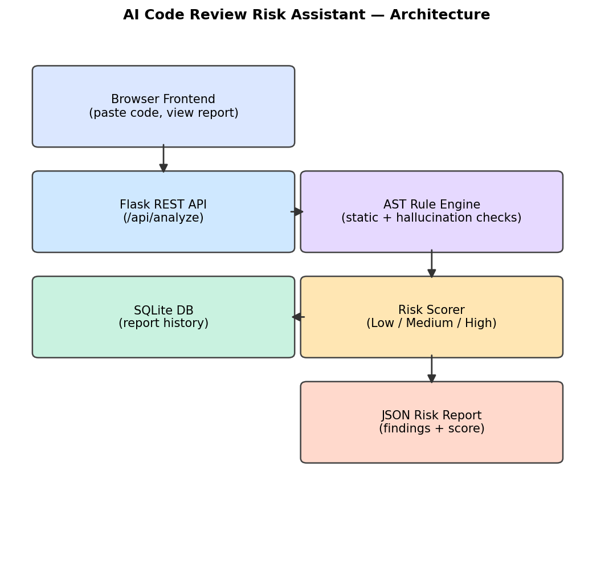

# AI Code Review Risk Assistant

## Problem
AI coding assistants now write a large share of the code that lands in real
pull requests, but review capacity hasn't scaled with it. Reviewers are
increasingly asked to catch not just ordinary bugs, but a newer failure mode —
LLM "hallucinated" code that looks fluent but calls functions that don't
exist, imports non-existent modules, or passes the wrong number of arguments.
Manually scanning every AI-generated diff for this is slow and easy to miss.

## Solution
This tool statically analyzes a pasted Python file or diff and flags two
categories of risk: (1) classic static-analysis issues — unused imports,
bare/swallowed exceptions, hardcoded secrets, missing `None` checks, and
overly complex functions — and (2) hallucination-pattern issues specific to
AI-generated code, like calls to non-existent standard-library functions,
attribute typos (`json.parse` instead of `json.loads`), and argument-count
mismatches. It produces a weighted Low/Medium/High risk score and a
structured JSON + human-readable report.

## Live Demo
Try it here: [janani-code-review-assistant.azurewebsites.net](https://janani-code-review-assistant-hfdjhpa3d5eva7g8.koreacentral-01.azurewebsites.net)

Hosted on Azure App Service (Free tier) via GitHub Actions CI/CD — every push to `main` auto-deploys.

## Architecture


The frontend posts pasted code to a Flask REST API. The API hands the source
to an AST-based rule engine (built on Python's `ast` module), which walks the
parse tree once to extract structural facts (imports, functions, calls) and
then runs a set of independent rule checks over those facts. Each rule
violation becomes a "finding" with a severity and a numeric weight; a scorer
sums the weights into a normalized 0–100 risk score and a Low/Medium/High
bucket. Reports are persisted to SQLite so past analyses can be browsed via
`/api/history`.

## Tech Stack
- Python 3.12
- Flask 3 (REST API)
- Python's built-in `ast` module (no external parser dependency)
- SQLite (via `sqlite3`, no ORM needed for this scale)
- Vanilla HTML/CSS/JS frontend (no build step)
- pytest for the test suite

## Features
- Paste or upload a Python file/diff for analysis
- Static checks: unused imports, bare/swallowed exceptions, hardcoded
  secrets/credentials, missing `None` guards, cyclomatic complexity
- Hallucination-pattern checks: non-existent imports, hallucinated
  attributes (e.g. `math.squareroot`), argument-count mismatches against a
  curated table of real stdlib function signatures
- Weighted Low/Medium/High risk score (0–100 normalized score)
- JSON report + a readable summary rendered in the browser
- Analysis history stored in SQLite and browsable via the UI
- 12 automated tests covering every rule

## Setup & Run
```bash
git clone <this-repo-url>
cd ai-code-review-assistant
pip install -r requirements.txt --break-system-packages   # or use a venv
cd src
python app.py
```
Then open `http://localhost:5000` in a browser. A sample vulnerable snippet
is pre-loaded in the textarea — click "Analyze Code" to see it scored.

### Deployment
This repo includes a `render.yaml` for one-click deployment on
[Render](https://render.com)'s free tier. Connect the GitHub repo in the
Render dashboard and it will build and start automatically using the
`gunicorn` command in `render.yaml`. Note: Render's free tier uses an
ephemeral filesystem, so the SQLite-backed `/api/history` feature resets on
every restart/redeploy — the core `/api/analyze` risk scoring is unaffected.

Run the test suite:
```bash
pytest tests/ -v
```

## Results / Demo
Pasting the sample snippet in `data/sample_snippets.md` (Sample 1: unused
import + bare except + hardcoded secret + missing None check) produces:

```json
{
  "risk_level": "High",
  "risk_score": 30,
  "total_weight": 12,
  "num_findings": 3,
  "findings": [
    {"rule_id": "UNUSED_IMPORT", "severity": "low", "weight": 1, "line": 1},
    {"rule_id": "HARDCODED_SECRET", "severity": "high", "weight": 8, "line": 11},
    {"rule_id": "MISSING_NONE_CHECK", "severity": "medium", "weight": 3, "line": 4}
  ]
}
```

See `demo/` for a screenshot of the web UI rendering this same report.

## What I learned
Writing the "hallucination pattern" checks was the most interesting part —
you can't just diff against a dictionary of real stdlib names, because most
hallucinated calls are *plausible* (`json.parse`, `math.squareroot`) rather
than random gibberish, so the checks need a small curated table of common
LLM mistakes rather than a generic linter approach. I also learned that
cyclomatic complexity thresholds need real-world calibration — the textbook
default of 10 was too lenient for the nested-conditional style AI assistants
tend to generate, so I tuned it down after testing against realistic
examples.

## Future improvements
- Extend the parser to Java (via `javalang`) to cover both listed tech-stack
  options, not just Python
- Add a diff-aware mode that only analyzes changed lines in a PR, with
  GitHub Action integration for CI
- Expand the hallucinated-function table using a larger corpus of real
  vs. LLM-generated code samples
- Add per-rule configurability (teams can tune weights/thresholds)
- Add authentication and per-user history instead of a single shared SQLite
  file, for multi-user deployments
